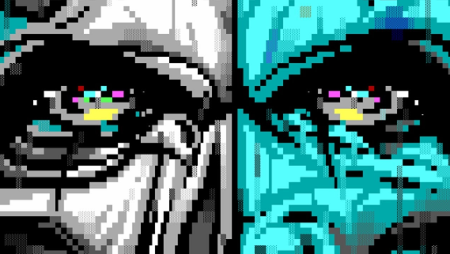

<h1 align="center">IRC ART</h1>

	

The term "IRC Art" is used to refer to text based visual art found on IRC. The art found on IRC has evolved past using just ASCII charcters. IRC clients today understand a number of special formatting characters. These characters allow IRC software to send and receive colors and formatting codes such as bold, italics, underline and others. This allows more possibilites now for creating ASCII/ANSI art for IRC. While it is possible to have support for 99 or even 256 colors, most art made for IRC follows the 16 color standard.
 
Check out the [ircart/wiki] for all your IRC Art related information & resources!

